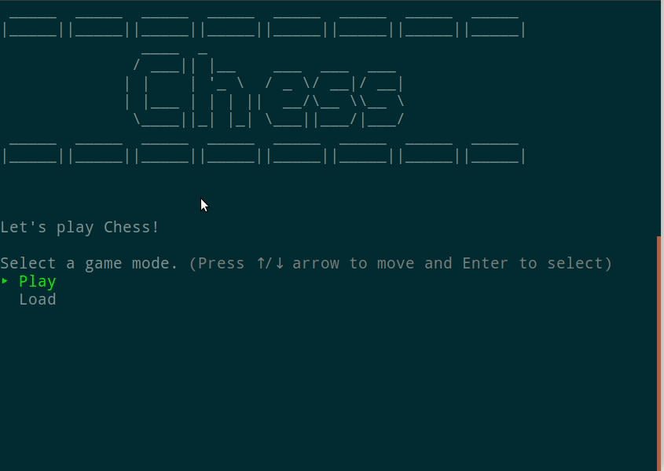

# Chess

CLI Chess game made with Ruby.<br>
Built using Object Oriented Programming principles in mind.<br>
Throughly tested using Rspec.<br>
Save a match in progress thanks to serialization.<br>

This is the final project for the Ruby Track from [The Odin Project](https://www.theodinproject.com/courses/ruby-programming/lessons/ruby-final-project?ref=lnav)

## Requirements

- [Ruby](https://www.ruby-lang.org/en/) >= 2.4
- [Bundler](https://bundler.io/) >= 2.1.2

## Installation

- Clone the repo locally.

- `cd` into the directory.

- And then execute:

```ruby
$ bundle install
```

## Demo



## How to Play

- Run `ruby game/game.rb`
- Select Play or Load (to play a previously saved game)

## Play Online

- Play in your browser with [repl.it](https://repl.it/@NicholasBerube/Chess#README.md)
- Make sure to zoom in on the console as it tends to feel small

## Gems Used

- [tty-prompt](https://github.com/piotrmurach/tty-prompt)
  - For player input and menus
- [figlet](https://github.com/tim/figlet)
  - For creating the title
- [pastel](https://github.com/piotrmurach/pastel)
  - Terminal output styling
